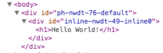

*********************************
Начало работы (Quick Start Guide)
*********************************

Это руководство поможет быстро развернуть ваш первый проект на CordJS и начать разрабатывать приложение.

.. _quickstart-install:

Установка CordJS
================

Фреймворк активно использует инфраструктуру Node.js, поэтому в первую очередь необходимо установить его. Проще всего
установить его используя систему пакетов в вашем Linux-дистрибутиве или OS X --- так будет проще обновлять. Но на
всякий случай для OS X можно скачать инсталлятор: https://nodejs.org/download/. На момент написания документации
поддерживается работа в версиях Node.js 0.12.x. Полноценная работа в Windows не поддерживается.

Установить CordJS очень просто из командной строки:

.. code-block:: bash

  sudo npm install -g cordjs
  cordjs --help

После этого в консоли будет доступна команда ``cordjs``, которая выполняет сборку (компиляцию) проекта и удобную
работу в "режиме разработчика".

.. _quickstart-create-project:

Создание нового проекта
=======================

К сожалению, команда ``cordjs`` пока не умеет создавать каркас пустого проекта автоматически. Но чтобы не создавать
всю структуру директорий вручную, можно воспользоваться специально подготовленным репозиторием на Github с пустым
проектом: https://github.com/cordjs/example-project:

.. code-block:: bash

  wget https://github.com/cordjs/example-project/archive/master.zip
  unzip master.zip
  cd example-project-master/
  ls -la

Большинство зависимостей, необходимых для базовой работы фреймворка, прописаны в файле ``package.json``. Чтобы их
установить (в папку ``node_modules``) необходимо, находясь в корне проекта, выполнить команду:

.. code-block:: bash

  npm install

Теперь, когда у нас есть конрневая директория проекта с базовой структурой, необходимо добавить в него пару *бандлов*
--- крупных блоков кода (модулей) из которых собирается приложение на CordJS:

* ``cord/core`` --- ядро фреймворка, бандл, в котором собраны базовые классы и сервисы, необходимые для разработки.
* ``hello/example`` --- бандл, в котором будут располагаться исходники данного приложения-примера (hello world!)

Все бандлы в проекте располагаются в директории ``public/bundles``. В рамках этой (корневой) директории бандлы могут
иметь "неплоскую" структуру, т.е. иметь произвольную структуру поддиректорий и, таким образом, разделять пространства
имён. Так, для собственных бандлов фреймворка зарезервировано пространство ``cord``, а для целей данного руководства
мы будем использовать пространство имён ``hello``.

Ядро фреймворка можно склонировать из репозитория на гитхабе. Его не следует комитить в собственный репозиторий,
чтобы легко получать обновления.

.. code-block:: bash

  cd public/bundles/cord
  git clone https://github.com/cordjs/core.git

Собственный бандл проекта можно создать вручную, а все исходники, в общем случае, следует содержать в репозитории
проекта. Создадим бандл ``example`` в пространстве имён ``hello``:

.. code-block:: bash

  # go to public/bundles
  cd ..
  mkdir -p hello/example
  cd hello/example
  touch config.coffee

Минимальное требование к структуре бандла --- наличие файла ``config.coffee`` в корне. Файл должен быть AMD-модулем и
возвращать JSON-структуру с конфигурацией бандла (роутами, сервисами и пр.):

.. code-block:: coffee
  :linenos:
  :caption: public/bundles/hello/example/config.coffee

  define ->
    {}

Для того, чтобы "включить" вновь созданный бандл в проекте, необходимо добавить его в конфигурационный файл проекта:

.. code-block:: coffee
  :linenos:
  :caption: public/app/application.coffee

  define -> [
    'hello/example'
  ]

Включать ``cord/core`` не нужно, он всегда добавляется автоматически.

Таким образом, мы получили базовый пустой проект и, наконец, можем начать писать код!

.. _quickstart-hello-world:

Hello World!
============

Для начала, мы хотим получить простую html-страничку с фразой "Hello world!". В CordJS всё, что видит пользователь
--- это виджеты, поэтому в первую очередь нам нужно создать виджет такой странички. С точки зрения исходников, виджет
представляет собой подпапку в папке ``widgets`` какого-либо бандла, в которой располагаются несколько исходных файлов
виджета. Находясь в корне проекта, выполните команды:

.. code-block:: bash

  cd public/bundles/hello/example
  mkdir -p widgets/helloWorldPage
  cd widgets/helloWorldPage
  touch HelloWorldPage.coffee
  touch helloWorldPage.html

Создадим минимальный пустой класс виджета. Можете пока не обращать внимания на свойство ``behaviourClass``. Файл
класса виджета должен называться так же, как и папка, но с заглавной буквы.

.. code-block:: coffee
  :linenos:
  :caption: public/bundles/hello/example/widgets/helloWorldPage/HelloWorldPage.coffee

  define [
    'cord!Widget'
  ], (Widget) ->

    class HelloWorldPage extends Widget

      behaviourClass: false

Файл шаблона виджета называется так же, как и папка, с расширением ``.html``. В качестве шаблонизатора используется
dustjs.

.. code-block:: html
  :linenos:
  :caption: public/bundles/hello/example/widgets/helloWorldPage/helloWorldPage.html

  <!doctype html>
    <head>
      {#css/}
    </head>

    <body>
      <h1>Hello World!</h1>
      {#widgetInitializer/}
    </body>
  </html>

Обратите внимание на использование двух плагинов ``{#css/}`` и ``{#widgetInitializer/}``. Для корректной работы
фреймвовка они должны быть вставлены в шаблон базового виджета (который владеет тегом ``<html>``) именно таким образом.

.. note::

  Позже станет понятно, что такой **базовый** виджет, который содержит теги ``html/head/body``, в одном
  пользовательском приложении только один.

Роуты
-----

Теперь, когда у нас есть готовый виджет страницы, осталось только сообщить фреймворку, по какому URL его показывать.
Для этого необходимо дописать пару строк в файле конфигурации бандла:

.. code-block:: coffee
  :linenos:
  :caption: public/bundles/hello/example/config.coffee

  define ->
    routes:
      '/':  # корневая страница
        widget: '//HelloWorldPage'

Двойной слеш в начале пути к виджету означает "корень текущего бандла".

Запуск
------

Теперь всё готово для запуска приложения. Находясь в корне проекта, выполните команду:

.. code-block:: bash

  cordjs run -w -c developer

Команда произведёт сборку проекта и запустит его в виде веб-сервера на Node.js, который "слушает" адрес по умолчанию
http://127.0.0.1:18180.

Во время сборки происходит компиляция ``.coffee`` в ``.js``, ``.styl`` в ``.css`` и т.д., дополнительные манипуляции
с исходниками. Сборка производится в отдельную подпапку ``target`` в корне проекта.

  Опция ``-w`` заставляет утилиту "слушать" изменения во всех исходниках и автоматически пересобирать/перезапускать
  приложение при любых изменениях.

  Опция ``-c developer`` задаёт название конфигурационного файла в из папки ``conf/``. В файле ``developer.js``
  установленны параметры, облегчающие разработку и отладку, такие как livereload --- автоматическая перезагрузка
  страницы (не нужно нажимать ``F5``) после каждой пересборки проекта.

Теперь можно открыть адрес http://127.0.0.1:18180/ в любом браузере и увидеть результат. Мы получили минимальное
рабочее приложение, разработанное с использованием CordJS. Но по функциональности оно ничем не отличается от
статической html-страницы. Далее мы усложним пример, чтобы показать основную суть и возможности, которые
предоставляет CordJS.

.. _quickstart-layout:

Добавим структуру
=================

CordJS создан с учётом потребности создавать относительно "большие" приложения, у которых имеется далеко не один
пользовательский экран. В таких приложениях обычно есть общие элементы, которые повторяются во всех или почти всех
экранах, например, навигация и подвал (footer). Для того чтобы не повторять базовую разметку и элементы навигации
каждый раз, в CordJS существует механизм так называемых "лейаутов" (layout), т.е. возможность "расширения" шаблона
одного виджета шаблоном другого.

Самый очевидный лейаут, который присутствует в каждом веб-приложении --- виджет, который владеет базовой разметкой
html-страницы (тегами ``html``, ``head`` и ``body``. Обычно такой виджет называется ``BaseLayout`` и является
единственным на всё приложение. Давайте его создадим:

.. code-block:: coffee
  :linenos:
  :caption: public/bundles/hello/example/widgets/baseLayout/BaseLayout.coffee

  define [
    'cord!Widget'
  ], (Widget) ->

    class BaseLayout extends Widget

      behaviourClass: false

.. code-block:: html
  :linenos:
  :caption: public/bundles/hello/example/widgets/baseLayout/baseLayout.html
  :emphasize-lines: 7

  <!doctype html>
    <head>
      {#css/}
    </head>

    <body>
      {#placeholder/}
      {#widgetInitializer/}
    </body>
  </html>

Обратите внимание, что вместо надписи "Hello World!" тут находится плагин ``{#placeholder/}``. Это специальная
конструкция, которая обозначает место, в которое будет вставляться контент других виджетов, которые используют этот
виджет в качестве лейаута. Проще один раз увидеть... Перепишем шаблон виджета ``HelloWorldPage`` таким образом,
чтобы он использовал вновь созданный ``BaseLayout``:

.. code-block:: html
  :linenos:
  :caption: public/bundles/hello/example/widgets/helloWorldPage/helloWorldPage.html
  :emphasize-lines: 3

  {#extend type="//BaseLayout"}
    {#inline}
      <h1>Hello World!</h1>
    {/inline}
  {/extend}

..

  ``{#extend}`` --- специальный плагин, который обозначает, что у текущего виджета нет собственного "корневого"
  DOM-элемента, а он только добавит контент в указанный layout-виджет. Всё, что заключено между открывающим и
  закрывающим "тегом" ``extend``, будет вставлено в плейсхолдер (placeholder) виджета ``BaseLayout``.

  ``{#inline}`` --- специальный плагин, который предназначен для вставки в плейсхолдер лейаута произвольного
  html-контента. Кроме произвольной разметки, в плейсхолдер может быть вставлен другой виджет с помощью плагина
  ``{#widget}``.

От предыдущей версии шаблона осталась только сама надпись --- то, что действительно относится к сути данного виджета.
Теперь мы можем использовать базовую разметку (``BaseLayout``) и для других виджетов-страниц, избегая дублирования кода.

Из-за особенностей процесса сборки, после создания нового виджета может понадобиться пересобрать проект заново:

.. code-block:: bash

  cordjs run -w -C -c developer

..

  Опция ``-C`` говорит о том, что нужно удалить папку ``target/``, прежде чем собрать проект. По умолчанию, сборщик
  перекомпилирует только изменённые файлы. Того же можно добиться, выполнив команду ``cordjs clean`` перед сборкой.

В результате в браузере мы увидим то же самое, но разметка в html-исходнике будет немного отличаться --- появится
дополнительная вложенность из-за тегов ``div``, соответствующих ``{#placeholder}`` и ``{#inline}``:

.. _quickstart-state:

Параметры и состояние (контекст) виджета
========================================

Пока что наши виджеты нет никакой динамики. Это далеко от реальной жизни. Для примера, можно "научить" ``BaseLayout``
принимать на вход заголовок (title) страницы и, соотстветственно, его отображать. Заголовок должен быть переменным,
поскольку у каждой страницы он может быть свой.

.. note::

  Почему заголовком страницы должен управлять именно ``BaseLayout``?

  Дело в том, что в CordJS "пропагандируется" принцип изоляции ответственности, т.е. каждый виджет должен отвечать
  только за ту разметку, которая присутствует в его собственном шаблоне. Виджет не должен "лезть" и модифицировать
  что-либо вне себя, за исключением публичных API других виджетов.

  Тег ``title`` должен находиться внутри ``head``, который объявлен в шаблоне виджета ``BaseLayout``.

Допишем несколько строк в класс виджета:

.. code-block:: coffee
  :linenos:
  :caption: public/bundles/hello/example/widgets/baseLayout/BaseLayout.coffee

  class BaseLayout extends Widget

    behaviourClass: false

    @initialCtx:
      title: ''

    @params:
      title: ':ctx'

..

  В ``@initialCtx`` объявляются значения по-умолчанию для переменных *контекста* виджета. **Контекст** --- структура,
  определяющая внутреннее динамическое состояние виджета. В идеале, знания шаблона и контекста виджета должно быть
  достаточно, чтобы получить отображение виджета (*в идеале*, потому что разработчики часто забывают это правило, а
  ещё некоторые аспекты отображения виджета, например, текущее положение скроллинга, технически трудно отражать в
  контексте).

  В ``@params`` перечисляются параметры, которые принимает на вход виджет и то, как виджет должен на них реагировать.
  В данном случае используется специальная (syntax-sugar) запись, которая означает команду просто записать пришедшее
  значение в одноимённую переменную контекста. По-другому то же самое можно было записать следующим образом:

  .. code-block:: coffee
    :linenos:
    :caption: public/bundles/hello/example/widgets/baseLayout/BaseLayout.coffee

    @params:
      title: (value) -> @ctx.set('title', value)

.. warning::

  Обратите внимание, что контекст (свойство ``@ctx``) виджета --- это исключительно **внутреннее** (приватное)
  состояние виджета, т.е. другие виджеты не должны пытаться читать или записывать в него напрямую. Тогда как
  параметры наоборот являются одним из аспектов публичного API виджета, т.е. того, как с ним взаимодействуют другие
  виджеты.

Добавим соответствующее изменение в шаблон виджета:

.. code-block:: html
  :linenos:
  :caption: public/bundles/hello/example/widgets/baseLayout/baseLayout.html
  :emphasize-lines: 2

  <head>
    <title>{title}</title>
    {#css/}
  </head>

..

  ``{title}`` --- обращение к переменной контекста ``@ctx.title``. Все переменные контекста доступны в шаблоне
  виджета напрямую.

Теперь мы можем использовать новый параметр в шаблоне виджета ``HelloWorldPage``:

.. code-block:: html
  :linenos:
  :caption: public/bundles/hello/example/widgets/helloWorldPage/helloWorldPage.html
  :emphasize-lines: 1

  {#extend type="//BaseLayout" title="Hello World Page"}
    {#inline}
      <h1>Hello World!</h1>
    {/inline}
  {/extend}

После этих манипуляций в браузере появится заголовок страницы "Hello World Page".

.. _quickstart-page-transitions:

Переходы между страницами (экранами)
====================================

Наше приложение всё ещё слишком простое, поскольку состоит из единственной страницы. Чтобы сделать его более похожим
на настоящее, добавим в него ещё один экран, отображающий текущее время. Для этого нам понадобится новый виджет
``CurrentTimePage``:

.. code-block:: coffee
  :linenos:
  :caption: public/bundles/hello/example/widgets/currentTimePage/CurrentTimePage.coffee

  define [
    'cord!Widget'
  ], (Widget) ->

    class CurrentTimePage extends Widget

      behaviourClass: false

.. code-block:: html
  :linenos:
  :caption: public/bundles/hello/example/widgets/currentTimePage/currentTimePage.html
  :emphasize-lines: 2

  {#extend type="//BaseLayout" title="Current Time Page"}
    {#inline}
      <a href="/">Go to main page</a>
    {/inline}
    {#widget type="//CurrentTime"/}
  {/extend}

В плейсхолдер лейаута ``BaseLayout`` тут вставлена не только разметка (навигация к главной странице), но и другой
виджет --- ``CurrentTime``. Предполагается, что именно он занимается непосредственно отображением времени. Вдруг, нам
понадобится отобразить время точно так же в другом месте :) Контент в плейсхолдер вставляется именно в том порядке, в
котором перечислен в шаблоне.

.. code-block:: coffee
  :linenos:
  :caption: public/bundles/hello/example/widgets/currentTime/CurrentTime.coffee

  define [
    'cord!Widget'
  ], (Widget) ->

    class CurrentTime extends Widget

      behaviourClass: false

      @initialCtx:
        time: '00:00:00'

      onShow: ->
        time = new Date
        @ctx.set('time', time.getHours() + ':' + time.getMinutes() + ':' + time.getSeconds())

.. note::

  Если в виджете объявлен метод ``onShow``, он выполняется перед **первым** рендерингом шаблона этого виджета, т.е.
  когда он первый раз "показывается". Его удобно использовать для выставления каких-либо начальных значений
  переменных контекста, если они не были заданы с помощью входящих параметров или не могут быть заданы простым
  скалярным выражением.

.. code-block:: html
  :linenos:
  :caption: public/bundles/hello/example/widgets/currentTime/currentTime.html

  
{time}

Осталось добавить роут для вновь-созданной странички:

.. code-block:: coffee
  :linenos:
  :caption: public/bundles/hello/example/config.coffee
  :emphasize-lines: 4,5

  define ->
    routes:
      # ...
      '/current-time':
        widget: '//CurrentTimePage'

и ссылку с главной:

.. code-block:: html
  :linenos:
  :caption: public/bundles/hello/example/widgets/helloWorldPage/helloWorldPage.html
  :emphasize-lines: 4-6

  {#extend type="//BaseLayout" title="Hello World Page"}
    {#inline}
      <h1>Hello World!</h1>
      

        <a href="/current-time">Show current time</a>
      

    {/inline}
  {/extend}

Всё готово! Перезапустите сборку проекта (из-за новых виджетов) и попробуйте открыть главную страницу в браузере и
попереходить по ссылкам туда-обратно. Обратите внимание, что перезагрузки страницы при этом не происходит, но
адресная строка в браузере изменяется. Находясь на любой из друх страниц вы можете обновить страницу браузера и
увидите то, что ожидаете. При этом "правильная" страница будет сразу загружена с сервера, а не реконструирована из
пустой болванки на стороне браузера (как это делают многие современные фреймворки).

Динамическое поведение (behaviour)
==================================

Внимательный наблюдатель должен был заметить одну ошибку в поведении предыдущего примера --- при переходе между
страницами заголовок (``title``) не изменяется. К сожалению, CordJS "не умеет" автоматически перерисовывать виджет
при изменении переменных контекста (позже будет объяснение). Разработчик должен "научить" виджет правильно обновлять
свой отображение в соответствие с изменившимся внутренним состоянием. Реакция может быть одной из двух: либо ручная
DOM-манипуляция, либо полная перерисовка (re-render) виджета.

Для описания такого динамического поведения в CordJS-виджетах используется отдельный класс-поведение (или behaviour).
Он записывается в отдельном файле внутри папки виджета, называется так же, как и сам файл виджета, но с суффиксом
``Behaviour``. Behaviour-класс выделен отдельно, поскольку в нём описывается только то, что происходит исключительно
в браузере, он может зависеть от библиотек, которые используют DOM, что в nodejs-среде недопустимо.

Итак, научим ``BaseLayout`` правильно обновлять содержимое своего тега ``title``:

.. code-block:: coffee
  :linenos:
  :caption: public/bundles/hello/example/widgets/baseLayout/BaseLayoutBehaviour.coffee

  define [
    'cord!Behaviour'
  ], (Widget) ->

    class BaseLayoutBehaviour extends Behaviour

      @widgetEvents:
        title: 'onTitleChange'

      onTitleChange: (data) ->
        document.title = data.value

Здесь:

  * ``title`` --- название переменной контекста виджета, на изменения которой подписываемся.
  * ``onTitleChange`` --- название, callback-метода в behaviour-классе, который обработает изменение ``title``.
  * ``data`` --- структура, содержащая старое (``.oldValue``) и новое (``.value``) значение переменной контекста.

Необходимо также "включить" behaviour-класс, удалив свойство ``behaviourClass`` из файла ``BaseLayout.coffee`` или
выставив его значение в ``null``.

